# The_Neighborhood

### 7th Jan. 2022

## Author  
  
[Jacqueline Ngabo](https://github.com/jay-nga)  
  
# Description  

This is a Web Application that allows users, after signining in, join a neighborhood as well as add a neghborhood, add businesses and update posts on the occurences of different neighborhoods.

##  Live Link  
 
https://theneighborhoods.herokuapp.com/  
## Screenshots 

### Landing Page
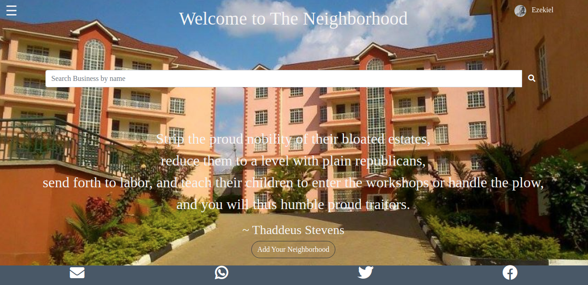

### Hoods Page

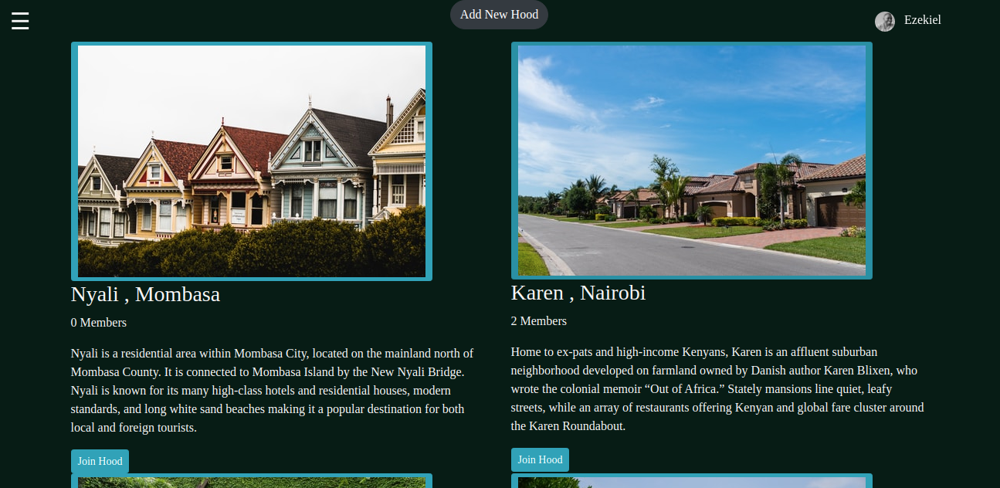

### Create Profile Form

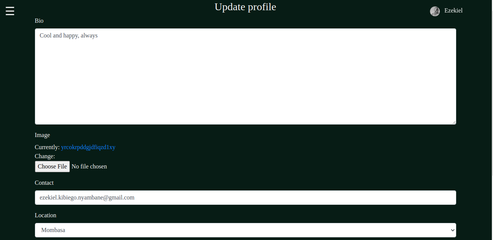

### Login Form


### Single Hood Page

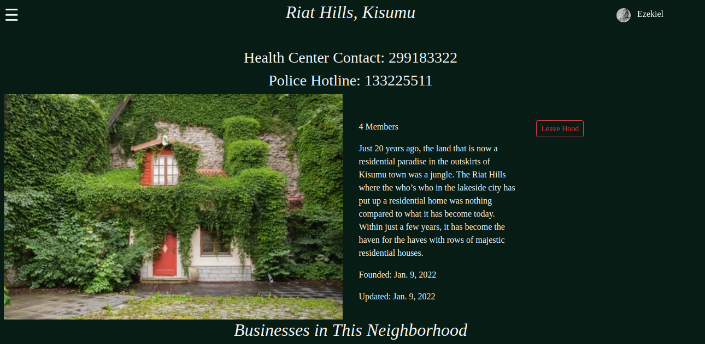
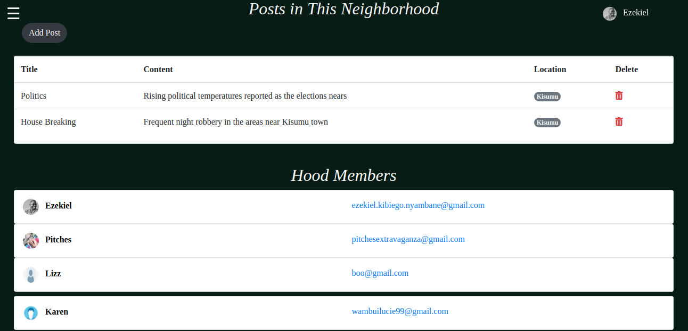
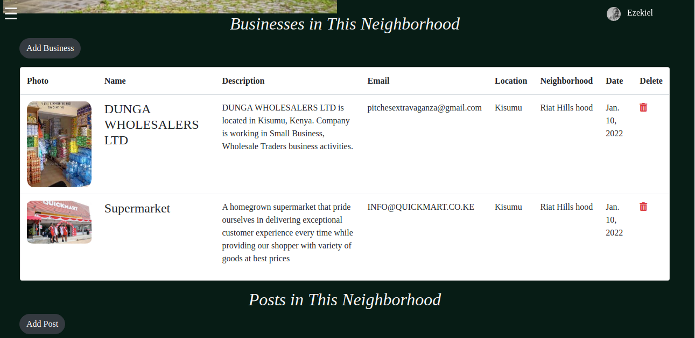

### Navbar Page

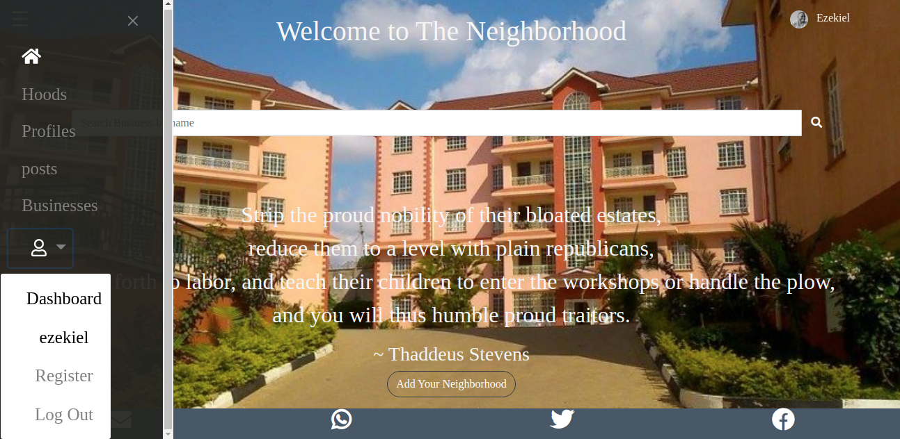

### All Businesses Page


### All Posts Page

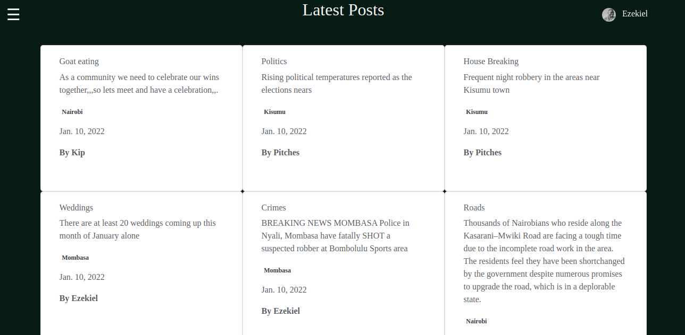

### All Profiles Page

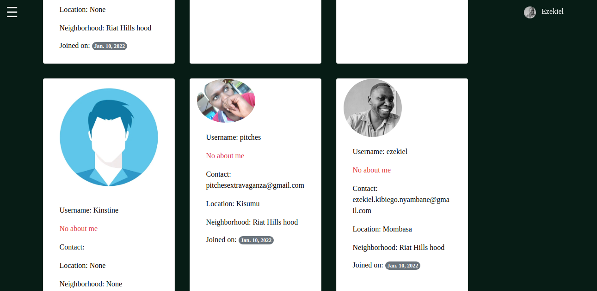

### Search Business Page

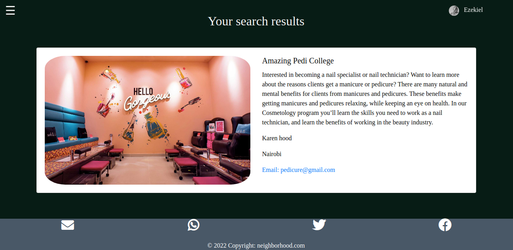

### User Profile Page

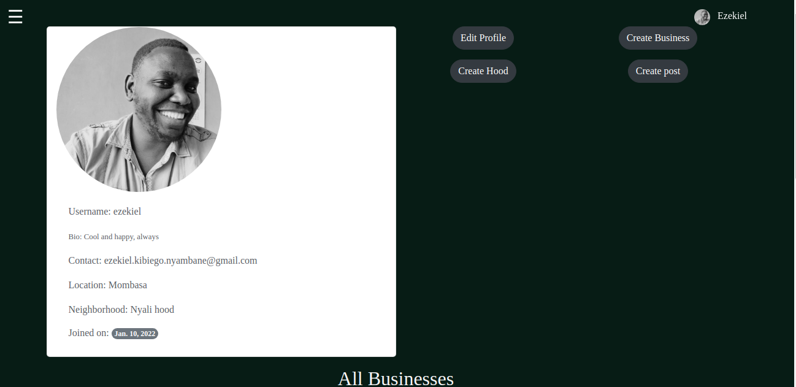

### Update Post Form

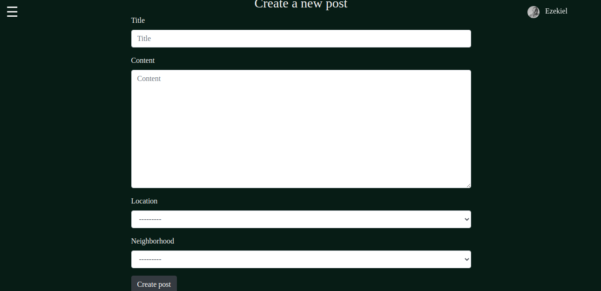

## Setup and Installation  
  
##### Clone the repository:  
 ```bash 
 git@github.com:ezekielkibiego/The_Neighborhood.git
```
##### Navigate into the folder and install requirements  
 ```bash 
cd The_Neighborhood
```
##### Install and activate Virtual  
 ```bash 
- python3 -m venv virtual 
- source virtual/bin/activate  
```  
##### Install Dependencies  
 ```bash 
 pip install -r requirements.txt 
```  
 ##### Setup Database  
  SetUp your database User,Password, Host then make migrate  
 ```bash 
python manage.py makemigrations
 ``` 
 Now Migrate  
 ```bash 
 python manage.py migrate 
```
##### Run the application  
 ```bash 
 python manage.py runserver 
``` 
##### Running the application  
 ```bash 
 python manage.py server 
```
##### Testing the application  
 ```bash 
 python manage.py test 
```
Open the application on your browser `127.0.0.1:8000`.  
  
  
## Technology used  
  
* [Python3.8](https://www.python.org/)  
* [Django==3.2.9](https://docs.djangoproject.com/en/2.2/)  
* [Heroku](https://heroku.com)  
  
  
## Known Bugs  
* There are no known bugs  
  
## Support and Contact Information 

To make a contribution to the code used or for any queries feel free to contact me via my email addresses ezekiel.nyambane@student.moringaschool.com or kibiezekiel@gmail.com

## License

### MIT LICENCE

#### Copyright (c) 2022 **Ezekiel Kibiego** ~ Moringa School

Permission is hereby granted, free of charge, to any person obtaining a copy of this software and associated documentation files (the "Software"), to deal in the Software without restriction, including without limitation the rights to use, copy, modify, merge, publish, distribute, sublicense, and/or sell copies of the Software, and to permit persons to whom the Software is furnished to do so, subject to the following conditions:

The above copyright notice and this permission notice shall be included in all copies or substantial portions of the Software.

THE SOFTWARE IS PROVIDED "AS IS", WITHOUT WARRANTY OF ANY KIND, EXPRESS OR IMPLIED, INCLUDING BUT NOT LIMITED TO THE WARRANTIES OF MERCHANTABILITY, FITNESS FOR A PARTICULAR PURPOSE AND NONINFRINGEMENT. IN NO EVENT SHALL THE AUTHORS OR COPYRIGHT HOLDERS BE LIABLE FOR ANY CLAIM, DAMAGES OR OTHER LIABILITY, WHETHER IN AN ACTION OF CONTRACT, TORT OR 
OTHERWISE, ARISING FROM, OUT OF OR IN CONNECTION WITH THE SOFTWARE OR THE USE OR OTHER DEALINGS IN THE SOFTWARE.


